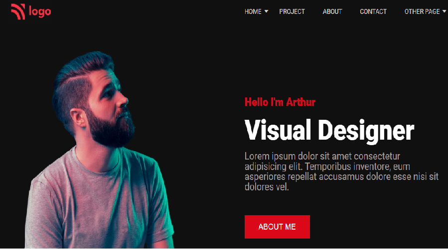

## Live Class Project 15

# Product Design Landing Page

### Concepts learnt
- Designing webpages with dark mode.
- using proper flex properties to fix all cards , blogs and banners for different screens.
- setting dark mode background for seperate elements.

Honest time taken to finish this project  is 2 days 

[netlify link](https://live-project-product-landpage.netlify.app/)

